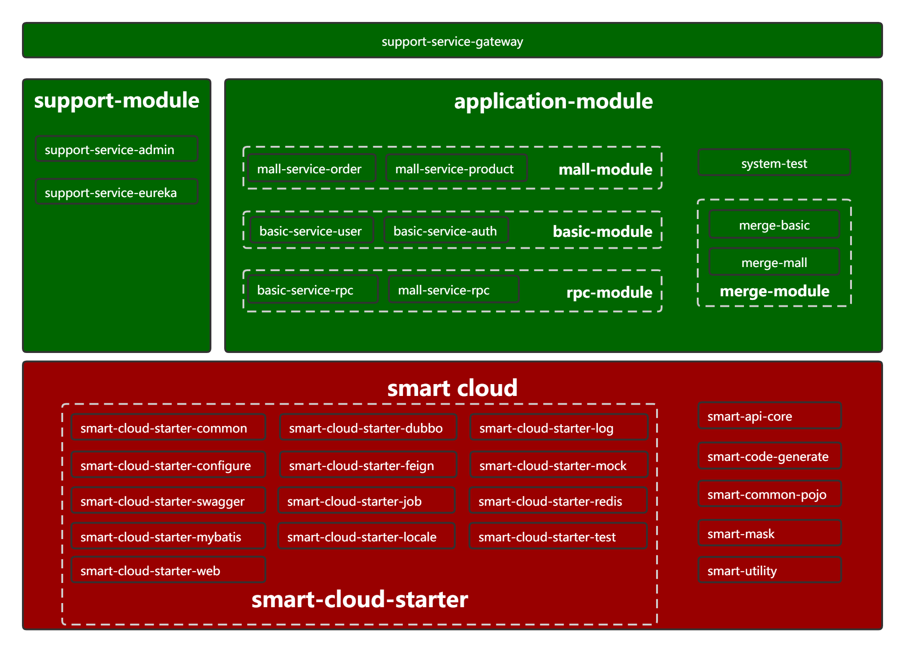

# 一、项目说明
此项目为基于[smart-cloud](https://github.com/smart-cloud/smart-cloud)的微服务示例项目。各模块说明如下：
## （一）服务说明
```
smart-cloud-examples
├── smart-cloud-example-framework -- 框架进一步封装
├── system-test -- 系统测试
├── merge-module -- 服务合并模块
|    ├── merge-basic -- 基础服务合并项目[端口:30001]
|    └── merge-mall -- 商城服务合并项目[端口:30002]
└── application-module -- 应用服务模块
     ├── application-common-config -- 公共配置
     ├── basic-module -- 基础服务模块（如文件服务、权限服务、登陆服务等）
     |    ├── basic-service-user -- 用户服务[端口:20031]
     |    └── basic-service-auth -- 权限服务[端口:20041]
     ├── mall-module -- 商城服务模块
     |    ├── mall-service-order -- 订单服务[端口:20011]
     |    └── mall-service-product -- 商品服务[端口:20021]
     ├── rpc-module -- rpc调用模块
     |    ├── basic-service-rpc -- 基础服务rpc模块
     |    ├── mall-service-rpc -- 商城服务rpc模块
     |    └── support-service-rpc -- 支撑服务rpc模块
     └── support-module -- 支撑服务模块
          ├── support-service-admin -- 注册中心[端口:10001]
          ├── support-service-eureka -- 监控[端口:10011]
          └── support-service-gateway -- 网关[端口:80]
```
## （二）工程模块图

# 二、环境搭建
- 更改hosts文件，添加如下内容（注册中心eureka会使用到）
```
  127.0.0.1       nodeA
```

- 安装[redis](https://github.com/microsoftarchive/redis/releases)，并启动
- 安装[mysql](https://www.mysql.com/downloads/)，执行/docs/sql下脚本
- 安装[seata](https://github.com/seata/seata/releases)服务端，并启动
- 服务启动（先启动eureka，然后依次启动mall下服务）

# 三、注意事项
- 针对**jasypt**加密，所有的需要合并的单体服务的**jasypt.encryptor.password**的值必须相同，否则会报错。

- 服务构建
```
单体服务构建：clean install
合体服务构建：clean install -P merge
```