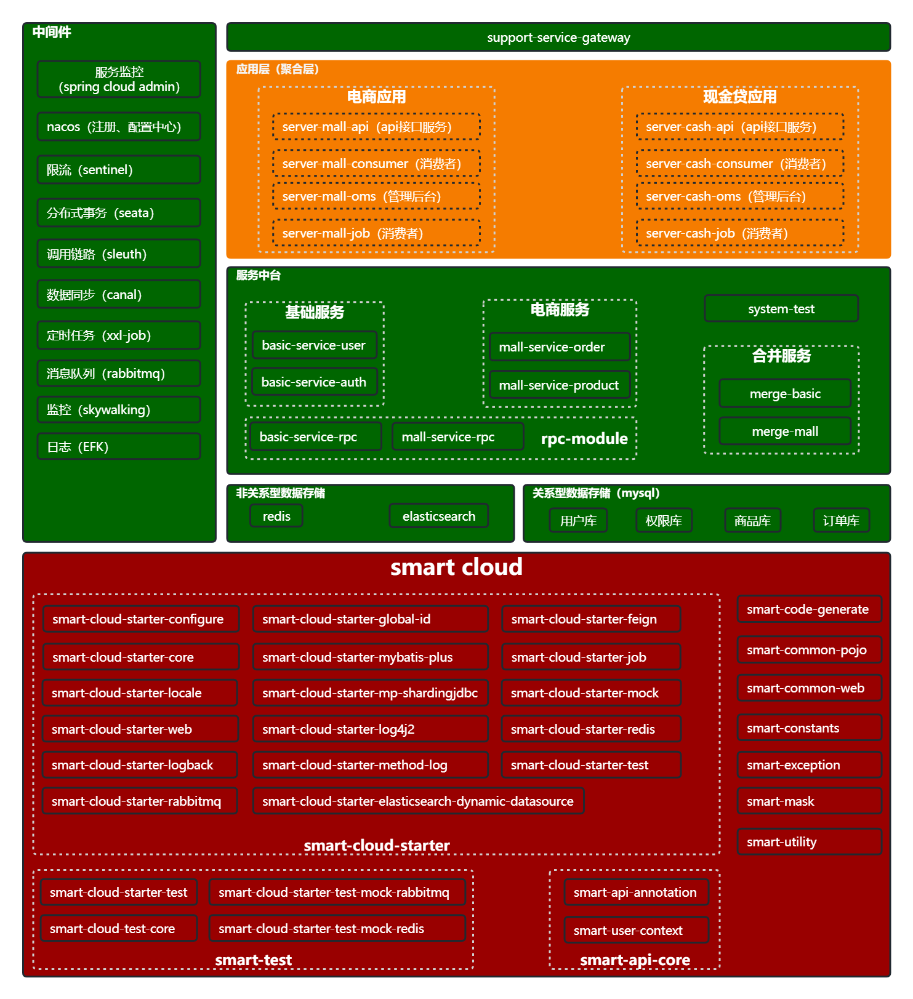
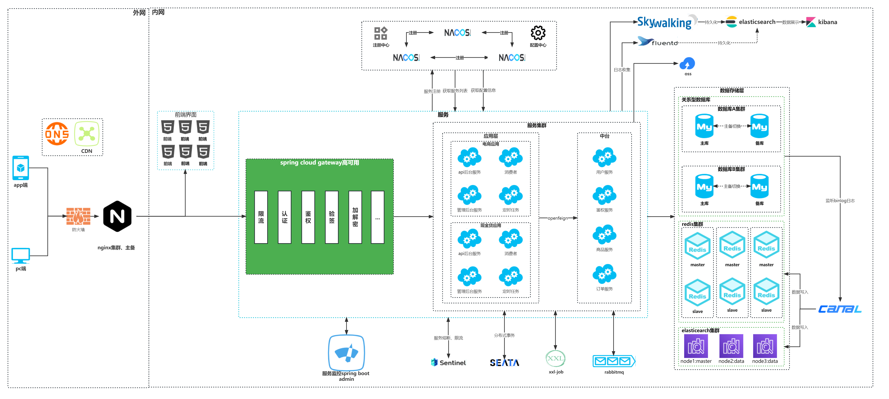
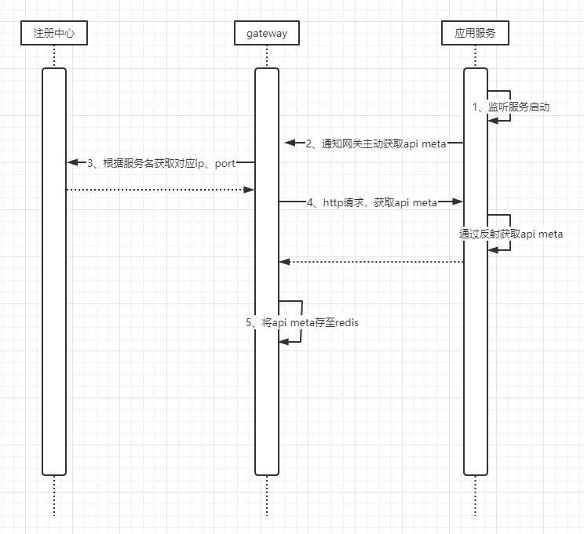
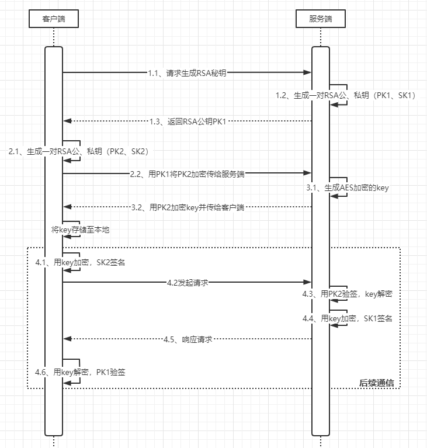
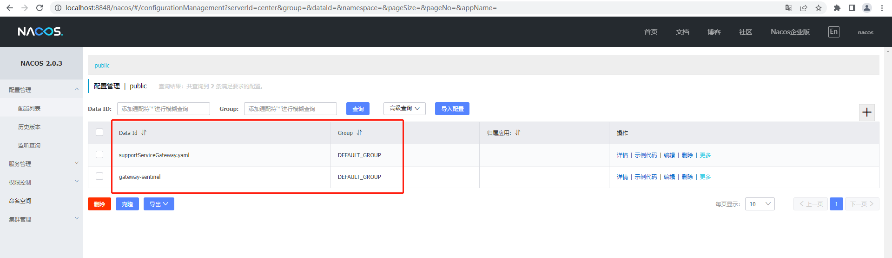
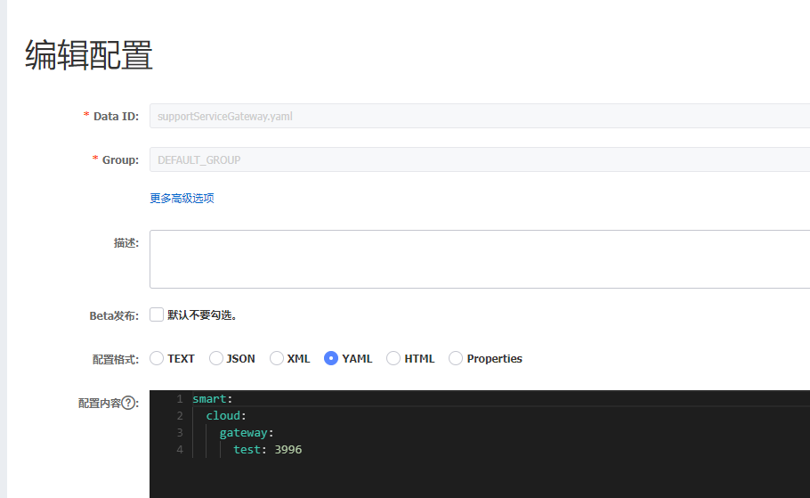
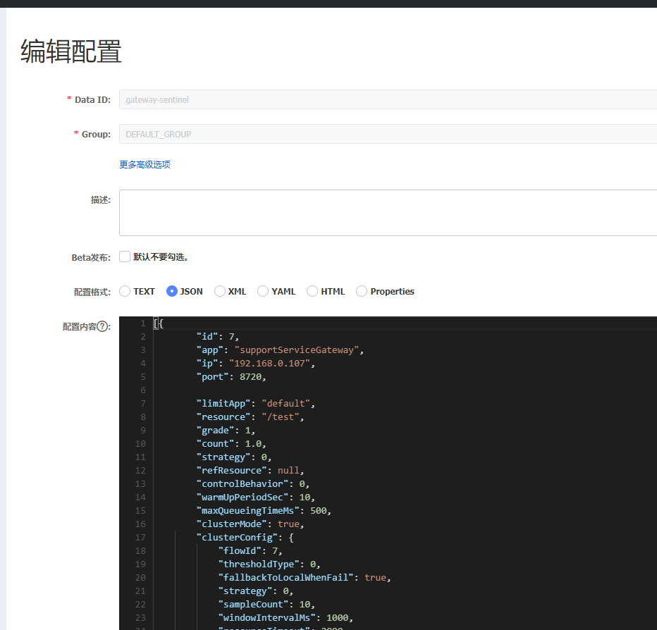

# 一、项目说明
> 此项目为基于[smart-cloud](https://github.com/smart-cloud/smart-cloud)的微服务示例项目。
> 自动化构建见[ci](https://github.com/smart-cloud/ci)

## （一）服务说明
```
smart-cloud-examples
├── smart-cloud-example-framework -- 框架进一步封装
├── system-test -- 系统测试
├── merge-module -- 服务合并模块
|    ├── merge-basic -- 基础服务合并项目[端口:30001]
|    └── merge-mall -- 商城服务合并项目[端口:30002]
└── application-module -- 应用服务模块
     ├── api-ac-core -- api meta信息上传gateway处理
     ├── app-auth-core -- 用户上下文信息处理
     ├── app-common-config -- 公共配置
     ├── basic-module -- 基础服务模块（如文件服务、权限服务、登陆服务等）
     |    ├── basic-service-user -- 用户服务[端口:20031]
     |    └── basic-service-auth -- 权限服务[端口:20041]
     ├── mall-module -- 商城服务模块
     |    ├── mall-service-order -- 订单服务[端口:20011]
     |    └── mall-service-product -- 商品服务[端口:20021]
     ├── rpc-module -- rpc调用模块
     |    ├── basic-service-rpc -- 基础服务rpc模块
     |    ├── mall-service-rpc -- 商城服务rpc模块
     |    └── support-service-rpc -- 支撑服务rpc模块
     └── support-module -- 支撑服务模块
          ├── support-service-admin -- 注册中心[端口:10001]
          └── support-service-gateway -- 网关[端口:80]
```
## （二）工程模块图


## （三）架构图


# 二、接口安全

## （一）流程
1、通过自定义注解，监听服务启动完毕后，通知gateway，gateway根据服务名去注册中心获取服务的ip、port，然后通过http主动去掉服务的接口获取api meta信息（是否签名、是否加密、是否需要鉴权等），存至redis。


**注意：此处为了接口安全考虑，没有直接将api meta信息由服务主动上报给gateway。**

2、后台管理系统在配置权限时，会通过rpc接口刷新网关服务存储的权限信息。

3、用户登陆成功后，会将所拥有的权限信息通过rpc上传给网关。

4、用户访问接口通过网关时，会与缓存在redis里的信息做加解密、鉴权等处理。

## （二）接口数据加解密、签名流程

### 1、约定
```
接口mapping url格式：服务模块名/接口使用端标志/接口模块名/接口名
如：user/api/loginInfo/login

接口使用端标记：
	api：app端使用的接口
	oms：管理后台使用的接口
	rpc：rpc接口
	
http get、http post共同部分，即http headers部分的数据，它包含请求时间戳（默认2分钟内有效）、请求的token、交易流水号、签名等4个自定义字段：
	smart-sign: 109ad1a8e05f8de345e6d780f09b001e97dc3d6fa9bbbe6936edb2b75a81864ac3b0b071e093af001fbffa479217540138b98f6f165e8246dd25a2536649f1f6
	smart-timestamp: 1555778393862
	smart-token: 4c2e22605001000rK
	smart-nonce: eb9f81e7cee1c000
```

### 2、Http GET
请求数据由http headers、url查询字符串组成，url查询字符串为实际请求的参数。
如http://localhost:10010/user/api/loginInfo/queryById?id=100

### 3、Http POST
请求数据采用json格式，通过流的形式传输。
请求数据由http headers、http body两部分组成，http body部分为请求的实际参数（json格式）。

#### 1.请求数据组成
**http body部分**
```
{
    "products": [{
        "buyCount": 1,
        "productId": 4
	}]
}
```

#### 2.响应对象Resp组成
```
{
	"head": {
		"transactionId": null,
		"code": "100200",
		"msg": "成功",
		"timestamp": 0
	},
	"body": {
		"id": "2",
		"name": "手机",
		"price": "1200"
	},
	"sign": "109ad1a8e05f8de345e6d780f09b001e97dc3d6fa9bbbe6936edb2b75a81864ac3b0b071e093af001fbffa479217540138b98f6f165e8246dd25a2536649f1f6"
}
```
### 4、加密、签名
#### 1.签名、加密的key传递


#### 2.请求方
##### （1）请求参数
```
Http Get请求方式 ：
1.url查询字符串中的参数以json的格式组装得到查询的json串；
2.sign = RSA签名（“httpmethod + http headers（按自然排序的json串） + url查询json串”组成）

Http Post请求方式 ：
1.将http body部分的数据json化；
2.AES加密body的json串；
3.sign = RSA签名（“httpmethod + http headers（按自然排序的json串） + AES加密body的json串”）
```
##### （2）返回结果
Http Get、Http Post方式响应信息加密、签名相同。
```
1.校验签名是否正确；
2.解密数据
head = AES解密(head的json串)
body = AES解密(body json串)
```

#### 3.响应方
##### （1）请求入参
```
Http Get请求方式 ：
校验签名是否正确
sign = RSA签名校验（“httpmethod + http headers（按自然排序的json串） + url查询的json串”组成，sign， 公钥）

Http Post请求方式 ：
1.校验签名是否正确
  sign = RSA签名校验（“httpmethod + http headers（按自然排序的json串） + AES加密body的json串”， 公钥）
2.AES解密body的json串；
```
##### （2）响应结果
Http Get、Http Post请求方式响应信息加密、签名相同。
```
head = AES加密(head的json串)
body = AES加密(body json串)
sign = RSA签名签名(AES加密(head的json串) + AES加密(body json串))
```

# 三、环境搭建
- 更改hosts文件，添加如下内容（注册中心eureka会使用到）
```
  127.0.0.1       nodeA
```

- 安装[redis](https://github.com/microsoftarchive/redis/releases)，并启动
- 安装[mysql](https://www.mysql.com/downloads/)，执行/docs/sql下脚本
- 安装[rabbitmq](https://www.rabbitmq.com)，并启动
- 安装[nacos](https://github.com/alibaba/nacos/releases)，并启动
  

  

  
- 安装[seata](https://github.com/seata/seata/releases/tag/v1.4.0)服务端，并启动
  - server sql见/smart-cloud-examples/docs/sql/seata.sql
  - file.conf文件配置
  ```
    service {
      #vgroup->rgroup
      vgroupMapping.smartcloud_tx_group = "smartcloud"
      #only support single node
      smartcloud.grouplist = "127.0.0.1:8091"
      #degrade current not support
      enableDegrade = false
      #disable
      disable = false
      #unit ms,s,m,h,d represents milliseconds, seconds, minutes, hours, days, default permanent
      max.commit.retry.timeout = "-1"
      max.rollback.retry.timeout = "-1"
    }
	
    store {
      ## store mode: file、db
      mode = "db"
      ## database store property
      db {
        ## the implement of javax.sql.DataSource, such as DruidDataSource(druid)/BasicDataSource(dbcp) etc.
        datasource = "druid"
        ## mysql/oracle/postgresql/h2/oceanbase etc.
        dbType = "mysql"
        driverClassName = "com.mysql.jdbc.Driver"
        url = "jdbc:mysql://127.0.0.1:3306/seata"
        user = "collin"
        password = "123456"
        minConn = 5
        maxConn = 30
        globalTable = "global_table"
        branchTable = "branch_table"
        lockTable = "lock_table"
        queryLimit = 100
        maxWait = 5000
      }
    }
  ```
- 将[smart-cloud](https://github.com/smart-cloud/smart-cloud)相关jar install到本地仓库
  - clone下[smart-cloud](https://github.com/smart-cloud/smart-cloud)
  - 进入smart-cloud目录，执行**mvn clean install -DskipDocker -Dmaven.test.skip=true -T 4**
- 服务启动顺序
  - 启动redis
  - 启动mysql
  - 启动rabbitmq
  - 启动seata
  - 启动nacos
  - 启动support-service-gateway
  - 最后依次启动mall下或basic下服务

# 四、注意事项
- 针对**jasypt**加密，所有的需要合并的单体服务的**jasypt.encryptor.password**的值必须相同，否则会报错。

- 服务构建
```
单体服务构建：clean install
合体服务构建：clean install -P merge
```

# 五、错误码
所属模块 | code | message
---| ---|---
basic-service-user | 100001 | 账号不存在
basic-service-user | 100002 | 用户被禁用
basic-service-user | 100003 | 用户已被删除
basic-service-user | 100004 | 用户名或密码错误
basic-service-user | 100005 | 该手机号已存在，请换一个重新注册
basic-service-user | 100006 | 该用户名已存在，请换一个重新注册
basic-service-auth | 110001 | 权限编码已存在
basic-service-auth | 110002 | 角色编码已存在
mall-service-order | 200001 | 库存更新失败
mall-service-order | 200002 | 商品不存在
mall-service-product | 300001 | 库存不足，操作失败
support-service-gateway | 400001 | 获取api meta失败
support-service-gateway | 400002 | rsa密钥对生成出错
support-service-gateway | 400003 | 登录前token失效
support-service-gateway | 400004 | 登录成功后token失效
support-service-gateway | 400005 | 请求参数中token缺失
support-service-gateway | 400006 | 请求签名缺失
support-service-gateway | 400007 | 请求参数签名校验失败
support-service-gateway | 400008 | 当前用户暂未登陆，获取userId失败
support-service-gateway | 400009 | 未获取到登陆缓存信息
support-service-gateway | 400010 | 请求时间戳不能为空
support-service-gateway | 400011 | 请求时间戳格式错误
support-service-gateway | 400012 | 请求时间戳非法
support-service-gateway | 400013 | security key过期
support-service-gateway | 400014 | AES key获取失败

# FAQ
## spring cloud gateway集成openfeign启动时卡死
openfeign不支持 reactive clients。解决方案：1.延迟（@Lazy）加载feign客户端；2.通过ObjectProvider<openfeign客户端>的方式获取feign的bean（参考：https://docs.spring.io/spring-cloud-openfeign/docs/current/reference/html/#reactive-support）.