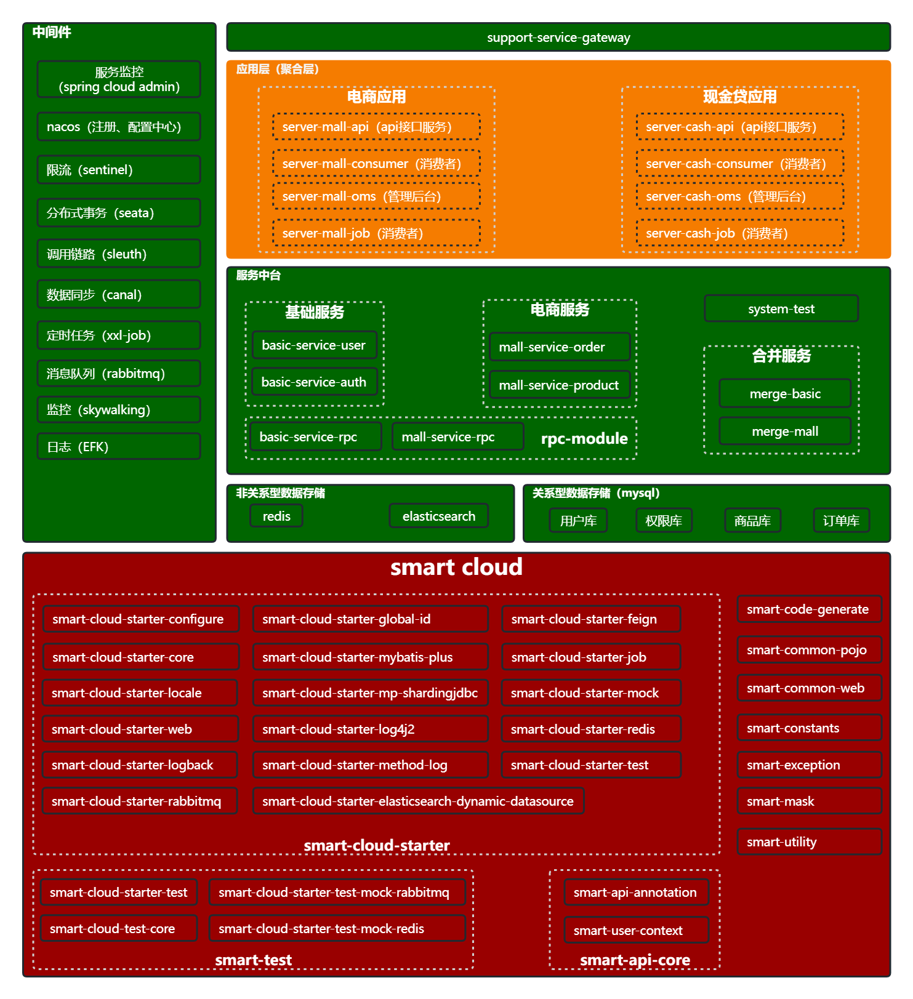
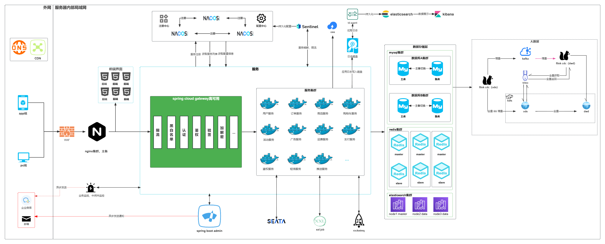
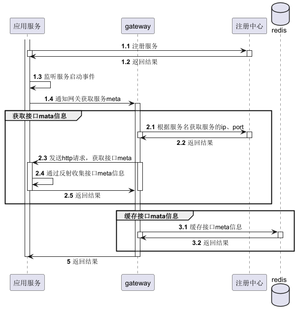
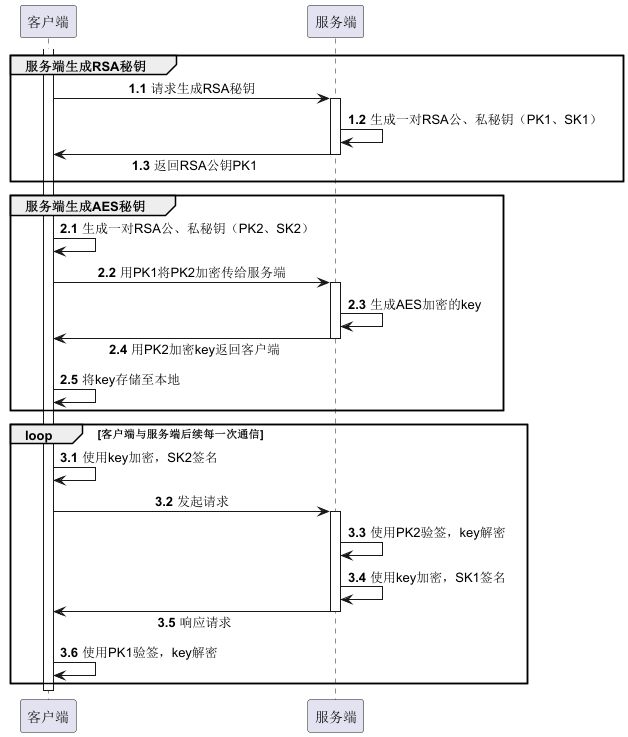
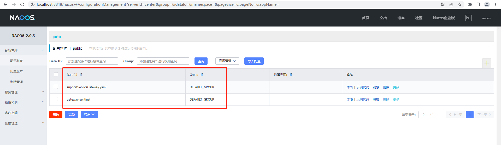
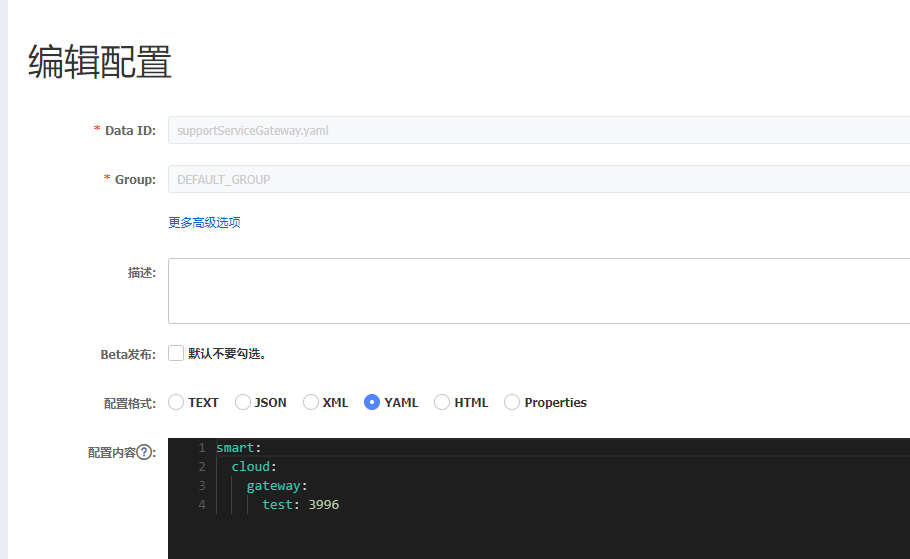
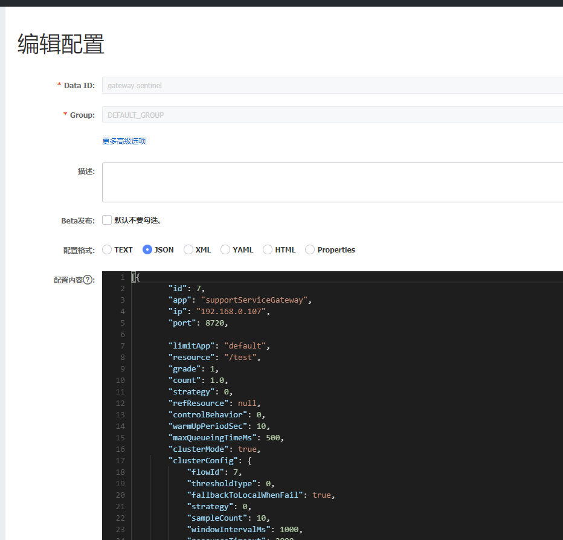

<h1 align="center">Smart Cloud Examples</h1>

<p align="center">
  基于 <a href="https://github.com/smart-cloud/smart-cloud">smart-cloud</a> 的企业级微服务示例项目
</p>

<p align="center">
  <a href="https://www.apache.org/licenses/LICENSE-2.0"></a>
  <a href="#"></a>
  <a href="#"></a>
  <a href="https://github.com/smart-cloud/smart-cloud"></a>
  <a href="https://github.com/smart-cloud/smart-cloud-examples/stargazers"></a>
  <a href="https://github.com/smart-cloud/smart-cloud-examples/network/members"></a>
</p>

<p align="center">
  <a href="#一项目简介">项目简介</a> •
  <a href="#二核心特性">核心特性</a> •
  <a href="#三技术栈">技术栈</a> •
  <a href="#四工程结构">工程结构</a> •
  <a href="#五接口安全">接口安全</a> •
  <a href="#六快速开始">快速开始</a> •
  <a href="#七错误码">错误码</a> •
  <a href="#faq">FAQ</a>
</p>

---

# 一、项目简介

> 此项目为基于 [smart-cloud](https://github.com/smart-cloud/smart-cloud) 的微服务示例项目，面向**企业级分布式系统**的教学与落地参考。
>
> 自动化构建见 [ci](https://github.com/smart-cloud/ci)

# 二、核心特性

| 特性 | 说明 |
|------|------|
| **接口安全体系** | 动态 API Meta 注册（网关主动拉取），多维度鉴权（token / 签名 / 时间戳 / 黑白名单） |
| **数据安全** | 请求与响应全链路 `AES + RSA` 加解密、`smart-*` 请求头签名验签机制 |
| **模块化架构** | 分 `support`（网关 / 注册中心）、`basic`（用户 / 权限）、`mall`（订单 / 商品）、`rpc`（服务调用）、`merge`（单体合并）五大功能域 |
| **服务合并部署** | 支持通过 `merge-module` 将多个微服务合并为单体应用部署，降低开发与运维成本 |
| **分布式事务** | 集成 `Seata` 实现分布式事务管理 |
| **流量治理** | 集成 `Sentinel` 实现限流、熔断等流量防护 |

# 三、技术栈

| 分类 | 技术 |
|------|------|
| 开发语言 | Java 8+ |
| 微服务框架 | smart-cloud 1.0.7-SNAPSHOT |
| 注册中心 | Nacos |
| 网关 | Spring Cloud Gateway |
| 分布式事务 | Seata 1.4.0 |
| 消息中间件 | RabbitMQ |
| 缓存 | Redis |
| 数据库 | MySQL |
| 安全 | RSA + AES 加解密、Jasypt 配置加密 |
| 构建工具 | Maven |

# 四、工程结构

## 服务说明

```
smart-cloud-examples
├── smart-cloud-example-framework          -- 框架进一步封装
├── system-test                            -- 系统测试
├── merge-module                           -- 服务合并模块
│    ├── merge-basic                       -- 基础服务合并项目 [端口: 30001, 31001]
│    └── merge-mall                        -- 商城服务合并项目 [端口: 30002, 31002]
└── application-module                     -- 应用服务模块
     ├── api-ac-core                       -- API Meta 信息上传 Gateway 处理
     ├── app-auth-core                     -- 用户上下文信息处理
     ├── app-common-config                 -- 公共配置
     ├── basic-module                      -- 基础服务模块
     │    ├── basic-service-user           -- 用户服务 [端口: 20031, 21031]
     │    └── basic-service-auth           -- 权限服务 [端口: 20041, 21041]
     ├── mall-module                       -- 商城服务模块
     │    ├── mall-service-order           -- 订单服务 [端口: 20011, 21011]
     │    └── mall-service-product         -- 商品服务 [端口: 20021, 21021]
     ├── rpc-module                        -- RPC 调用模块
     │    ├── basic-service-rpc            -- 基础服务 RPC 模块
     │    ├── mall-service-rpc             -- 商城服务 RPC 模块
     │    └── support-service-rpc          -- 支撑服务 RPC 模块
     └── support-module                    -- 支撑服务模块
          ├── support-service-admin        -- 注册中心 [端口: 10001, 11001]
          └── support-service-gateway      -- 网关 [端口: 10002, 11002]
```

## 工程模块图

<p align="center">
  
</p>

## 架构图

<p align="center">
  
</p>

# 五、接口安全

## 安全流程

1. 通过自定义注解，监听服务启动完毕后通知 Gateway；Gateway 根据服务名去注册中心获取服务的 IP、Port，然后通过 HTTP 主动拉取服务的 API Meta 信息（是否签名、是否加密、是否需要鉴权等），存至 Redis。

<p align="center">
  
</p>

> **注意：** 此处为了接口安全考虑，没有直接将 API Meta 信息由服务主动上报给 Gateway。

2. 后台管理系统在配置权限时，会通过 RPC 接口刷新网关服务存储的权限信息。
3. 用户登录成功后，会将所拥有的权限信息通过 RPC 上传给网关。
4. 用户访问接口通过网关时，会与缓存在 Redis 里的信息做加解密、鉴权等处理。

## 接口数据加解密、签名流程

### 1. 约定

> 只支持 `application/json` 格式的数据加解密、签名！

```
接口 mapping URL 格式：服务模块名/接口使用端标志/接口模块名/接口名
如：user/api/loginInfo/login

接口使用端标记：
    api ：App 端使用的接口
    oms ：管理后台使用的接口
    rpc ：RPC 接口

HTTP Headers 自定义字段（含请求时间戳、Token、交易流水号、签名）：
    smart-sign:      RSA 签名串
    smart-timestamp: 请求时间戳（默认 2 分钟内有效）
    smart-token:     请求 Token
    smart-nonce:     交易流水号
```

### 2. 响应对象 Response 组成

```json
{
    "nonce": "eb9f81e7cee1c000",
    "code": "100200",
    "msg": "成功",
    "body": {
        "id": "2",
        "name": "手机",
        "price": "1200"
    },
    "timestamp": 1555778393862,
    "sign": "109ad1a8e05f8de3..."
}
```

### 3. 签名与加密

#### 密钥传递流程

<p align="center">
  
</p>

#### 请求参数

```
1. 参数定义
   H = HTTP Headers（smart-timestamp、smart-nonce、smart-token 按自然排序的 JSON 串）
   Q = BASE64(AES(URL 参数，如 a=1&b=2&c=3))
   B = BASE64(AES(Body 的 JSON 串))
   sign = RSA 签名（"httpmethod + H + Q + B"）

2. 请求方处理逻辑
   （1）如果需要加密，则先加密，再进行 Base64 处理，最后生成签名；否则直接 Base64 处理后签名。
   （2）如果有 URL 传参，需对参数进行（加密）Base64 处理，然后通过参数 q 请求。

3. 处理步骤
   请求方：AES 加密 → Base64 Encode → RSA 签名
   接收方：RSA 验签 → Base64 Decode → AES 解密
```

#### 返回结果

> 对返回数据处理步骤：AES 加密 → Base64 处理 → RSA 签名

```
1. 参数定义
   sign = RSA 签名（"Response#nonce + Response#timestamp + base64(AES(Response#body))"）

2. 接收方处理逻辑
   （1）填充 Response#nonce、Response#timestamp
   （2）如果需要加密，则 AES 加密 body 后 Base64 处理，最后签名；否则直接 Base64 后签名。

3. 处理步骤
   接收方：AES 加密 → Base64 Encode → RSA 签名
   请求方：RSA 验签 → Base64 Decode → AES 解密
```

#### 代码实现

- 后端接收请求：[DataSecurityServerHttpRequestDecorator.java](application-module/support-module/support-service-gateway/src/main/java/org/smartframework/cloud/examples/support/gateway/filter/access/core/datasecurity/DataSecurityServerHttpRequestDecorator.java)
- 后端返回信息：[DataSecurityServerHttpResponseDecorator.java](application-module/support-module/support-service-gateway/src/main/java/org/smartframework/cloud/examples/support/gateway/filter/access/core/datasecurity/DataSecurityServerHttpResponseDecorator.java)

# 六、快速开始

### 环境依赖

| 中间件 | 说明 |
|--------|------|
| [Redis](https://github.com/microsoftarchive/redis/releases) | 缓存 |
| [MySQL](https://www.mysql.com/downloads/) | 数据库 |
| [RabbitMQ](https://www.rabbitmq.com) | 消息队列 |
| [Nacos](https://github.com/alibaba/nacos/releases) | 注册中心 / 配置中心 |
| [Seata](https://github.com/seata/seata/releases/tag/v1.4.0) | 分布式事务 |

### 搭建步骤

**1. 安装并启动中间件**

```bash
# 依次启动
Redis → MySQL → RabbitMQ → Nacos → Seata
```

**2. 初始化数据库**

执行 `/docs/sql` 目录下的 SQL 脚本：

```
docs/sql
├── basic-module-sql
│    ├── demo_auth.sql
│    └── demo_user.sql
├── mall-module-sql
│    ├── demo_order_0.sql
│    ├── demo_order_1.sql
│    └── demo_product.sql
└── seata.sql
```

**3. Nacos 配置**

在 Nacos 中导入相关配置文件（参考 `docs/nacos` 目录）：

<p align="center">
  
  <br><br>
  
  <br><br>
  
</p>

**4. Seata 配置**

- Server SQL 见 `docs/sql/seata.sql`
- `file.conf` 关键配置：

```
service {
    vgroupMapping.smartcloud_tx_group = "smartcloud"
    smartcloud.grouplist = "127.0.0.1:8091"
    enableDegrade = false
    disable = false
    max.commit.retry.timeout = "-1"
    max.rollback.retry.timeout = "-1"
}

store {
    mode = "db"
    db {
        datasource = "druid"
        dbType = "mysql"
        driverClassName = "com.mysql.jdbc.Driver"
        url = "jdbc:mysql://127.0.0.1:3306/seata"
        user = "collin"
        password = "123456"
        minConn = 5
        maxConn = 30
        globalTable = "global_table"
        branchTable = "branch_table"
        lockTable = "lock_table"
        queryLimit = 100
        maxWait = 5000
    }
}
```

**5. 安装 smart-cloud 依赖**

```bash
git clone https://github.com/smart-cloud/smart-cloud.git
cd smart-cloud
mvn clean install -DskipDocker -Dmaven.test.skip=true -T 4
```

**6. 启动服务**

按以下顺序启动：

```
Redis → MySQL → RabbitMQ → Seata → Nacos → support-service-gateway → 业务服务
```

### 服务构建

```bash
# 单体服务构建
mvn clean install

# 合并服务构建
mvn clean install -P merge
```

# 七、错误码

| 所属模块 | Code | Message |
|---------|------|---------|
| basic-service-user | 100001 | 账号不存在 |
| basic-service-user | 100002 | 用户被禁用 |
| basic-service-user | 100003 | 用户已被删除 |
| basic-service-user | 100004 | 用户名或密码错误 |
| basic-service-user | 100005 | 该手机号已存在，请换一个重新注册 |
| basic-service-user | 100006 | 该用户名已存在，请换一个重新注册 |
| basic-service-auth | 110001 | 权限编码已存在 |
| basic-service-auth | 110002 | 角色编码已存在 |
| mall-service-order | 200001 | 库存更新失败 |
| mall-service-order | 200002 | 商品不存在 |
| mall-service-product | 300001 | 库存不足，操作失败 |
| support-service-gateway | 400001 | 获取 API Meta 失败 |
| support-service-gateway | 400002 | RSA 密钥对生成出错 |
| support-service-gateway | 400003 | 登录前 Token 失效 |
| support-service-gateway | 400004 | 登录成功后 Token 失效 |
| support-service-gateway | 400005 | 请求参数中 Token 缺失 |
| support-service-gateway | 400006 | 请求签名缺失 |
| support-service-gateway | 400007 | 请求参数签名校验失败 |
| support-service-gateway | 400008 | 生成签名失败 |
| support-service-gateway | 400009 | 生成签名 Key 失败 |
| support-service-gateway | 400010 | 请求时间戳不能为空 |
| support-service-gateway | 400011 | 请求时间戳格式错误 |
| support-service-gateway | 400012 | 请求时间戳非法 |
| support-service-gateway | 400013 | Security Key 过期 |
| support-service-gateway | 400015 | 命中黑名单列表，禁止访问 |
| support-service-gateway | 400016 | 不在白名单中，禁止访问 |
| support-service-gateway | 400017 | 不支持数据安全 |

# 注意事项

- 针对 **Jasypt** 加密，所有需要合并的单体服务的 `jasypt.encryptor.password` 的值必须相同，否则会报错。

# FAQ

### Spring Cloud Gateway 集成 OpenFeign 启动时卡死

OpenFeign 不支持 Reactive Clients。

**解决方案（任选其一）：**

1. 延迟加载 Feign 客户端：使用 `@Lazy` 注解
2. 通过 `ObjectProvider<OpenFeign客户端>` 的方式获取 Feign Bean（参考：[Spring Cloud OpenFeign 官方文档](https://docs.spring.io/spring-cloud-openfeign/docs/current/reference/html/#reactive-support)）

# 开源协议

本项目基于 [Apache License 2.0](LICENSE) 开源协议。
